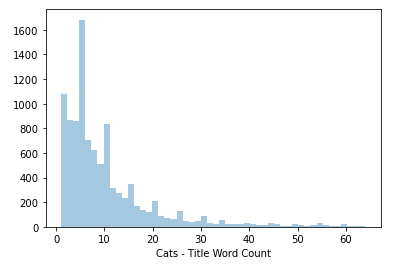
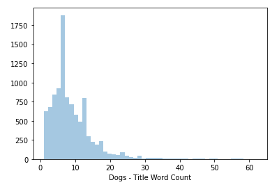
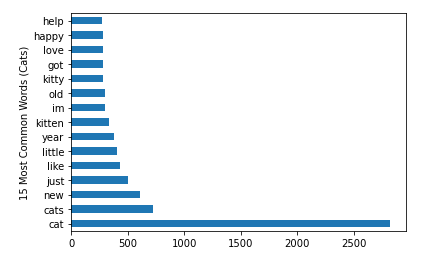
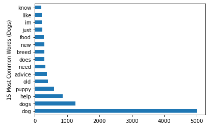
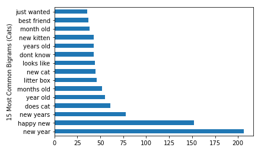
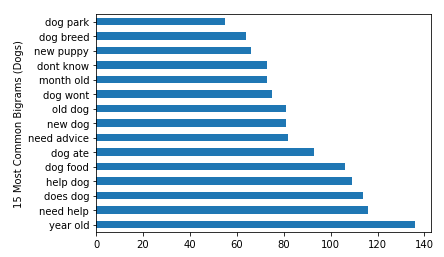
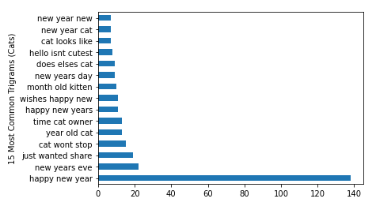
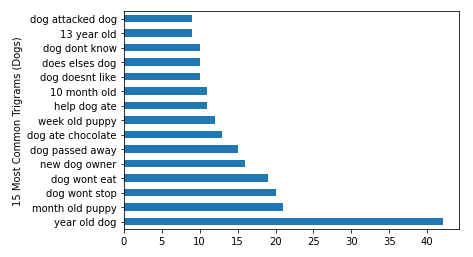
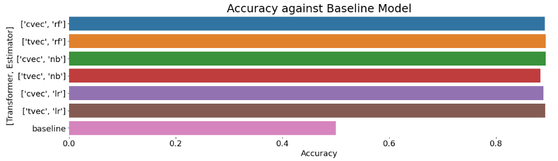

#  Project 3: The Best Business Model

## Table of Contents
* Problem Statement
* Data Collection and Data Dictionaries
* Data Cleaning
* Exploratory Data Analysis (EDA)
* Pre-Processing and Modelling
* Evaluation and Conceptual Understanding
* Conclusion and Recommendations
* References

## Problem Statement

Reddit is a massive collection of forums where people can share social news and content. Essentially, posts are organised according to subject into user-created 'subreddits'.

Members submit content (such as images, texts, and links) to subreddits, which can then be voted up ('upvote') or down ('downvote') by other members. 2019, many news reports reveal that there has been a rapidly growing interest in pet ownership. More people have expressed interest in adopting or fostering dogs and cats for various reasons - such as for companionship during circuit breaker or ease of caring for pets due to work-from-home arrangements.

Introducing "CatDog" - a “start-up” company in the Pet Industry.

CatDog has outsourced us data scientists to:
 1) examine the topics of interest/needs of these new dog and cat owners
 2) provide relevant suggestions on creating new services for dog and cat owners.
 3) Figure out the wants and needs of dog and cat owners by looking at relevant subreddits so that we can suggest a viable business model for pet lovers to venture into the pet industry.

We aim to develop 3 supervised classification models:
 1) Random Forest Classifier
 2) Multinomial Naive Bayes
 3)Logistics Regression Classifier

We select one model that best predicts the classification of the subreddit for current and future posts submitted by either dog or cat owners. Success will be evaluated based on the accuracy score (which tells us its predictive power) of both models on the test set, and look at the most important word features for that particular model to draw conclusions for CatDog.

CatDog has specifically asked us to source information from reddit, as they would like to target an international clientele.

## Data Collection and Data Dictionaries

The dataset is scraped from r/cats and r/dogs subreddit. The reasons for selecting these two subreddits are: 
1. They are generic subreddits which encompasses all topics related to cats and dogs - not discriminating against any breeds. Hence, it would be interesting to know the prominent keywords in each subreddit, which will influence the business decisions for CatDog.
2. As of writing this README, there are 3,277,095 members in the r/cats subreddit and 2,303,326 members in the r/dogs subreddit. This forms a large enough database for our model to develop.

Utilising APIs, we scraped around 10,000 posts from each subreddit. There are many different components within each document in the entire corpus. Specifically, we would target the post titles because there was a significant amount of empty body text for posts within the r/cats subreddit.

## Data Cleaning

The data is cleaned by using these steps:

<li>Tokenizing
<li>Removing Stopwords
<li>Lemmatizing
<li>Removing Punctuation and Lower Characters (through CountVectorizer and TfidfVectorizer) (Pre-Processing)

## Exploratory Data Analysis (EDA)

These are the visualisations that were plotted (for r/cats and r/dogs):

1. Distribution of Title Lengths and Number of Words (separated into Cats and Dogs)

2. Frequency of the top 15 most common words, bigrams and trigrams (Separated into Cats and Dogs)

3. Accuracy of Models against Baseline Model

## Pre-Processing and Modelling

The three models we chose to explore were:

<li> Random Forest
<li> Naive Bayes
<li> Logistic regression

 We first performed train, test, split, and with each model being instantiated and fitted with the TfidfVectorizer and CountVectorizer. The test scores were computed below (accuracy).

### Evaluation and Conceptual Understanding

|Model|Accuracy|
|---|---|
|Random Forest (CountVectorizer)|0.892560|
|Random Forest (TfidfVectorizer)|0.894072|
|Naive Bayes (CountVectorizer)|0.893064|
|Naive Bayes (TfidfVectorizer)|0.883327|
|Logistic Regression (CountVectorizer)|0.889203|
|Logistic Regression (TfidfVectorizer)|0.892561|

<li> Selecting Accuracy within the Confusion Matrix

Out of the confusion matrix, we chose to focus on accuracy. This means that we wanted to predict that future posts in r/cats and r/dogs would be correctly predicted into their subreddits.

This is important for the model to do so - which allows us to ensure that our business model (eventually selected by CatDog) remains relevant and popular. If, in the event that the accuracy is no longer high, there needs to be a tweaking of the parameters in order to suit the changes within the subreddits.

<li> Selecting Random Forest + TfidfVectorizer and Naive Bayes + CountVectorizer

|Model|Training Score|Test Score/Accuracy|Vectorizer|
|---|---|---|---|
|Random Forest|0.8895|0.9565|TFIDF|
|Naive Bayes|0.9109|0.9476|CountVectorizer|

Both models perform rather well in fitting with the training data, but the Naive Bayes model scoring better by 2%. There is more underfitting in the Random Forest model, however the test data is able to fit the model much better than on the Naive Bayes model.

With such close scores, we can look towards the Confusion Matrix. In this problem, I base it on the Accuracy of the models. This means that we wanted to predict that future posts in r/cats and r/dogs would be correctly predicted into their subreddits.

This is important for the model to do so - which allows us to ensure that our business model (eventually selected by CatDog) remains relevant and popular. If, in the event that the accuracy is no longer high, there needs to be a tweaking of the parameters in order to suit the changes within the subreddits.

Therefore, we will use Random Forest + Tfidf Vectorizer.

## Conclusion and Recommendations

<b>Improvements to the Model</b>
<li> For modeling rigor, literal subreddit name references should have been removed as individual words (e.g. "dog", "cat") were left in earlier on.
<li>Having posts with more unique words helps to distinguish between spam and ham but;
<li>Not all posts with unique words are relevant, so we have to focus more on the coefficient of frequently appearing words
<li> Perhaps this project could be improved by performing a form of sentiment analysis on the data in future studies. Lastly, though this model scored only around ~ 90% accuracy on testing data, this model still predicts much better than the baseline (~ 50.6%) and might be helpful in differentiating between dogs and cats.
<li> Further analysis can be done on the emojis within the titles.

 <b>Business recommendations</b>

<li>Explore other forums that are more local e.g. Hardwarezone because Reddit posts are more global and may not attune well to local context even though CatDog wants to reach out to an international clientele. Starting small within the local context would be a better way to 'taste' the market first.
<li>r/dogs - more practical and ‘discussion’ driven
Create consultancy and onboarding services for new dog owners
<li>If interested to bring in breeds, the top words can signify the popular ones among dog lovers
<li>r/cats - sharing of digital media
Grooming services or venture into F&B (e.g. cat café)
<li>Usage of Words for Impactful Marketing - based on the violin plots, words in marketing tools should target to have unique words for r/dogs < 8 and r/cats < 5. As a base guideline, marketing the business model should fit the behaviour of the posters within the subreddit.

### References

1. https://www.reddit.com/r/cats/
2. https://www.reddit.com/r/cats/
---
